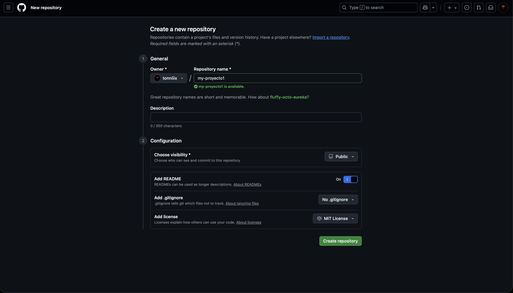

<center>

# TÍTULO DE LA PRÁCTICA


</center>

***Antonio:***
***1ºDAW:*** 

### ÍNDICE

+ [Introducción](#id1)
+ [Objetivos](#id2)
+ [Material empleado](#id3)
+ [Desarrollo](#id4)
+ [Conclusiones](#id5)


#### ***Introducción***. <a name="id1"></a>

"Esta práctica consiste en el flujo de trabajo fundamental de Git y GitHub. Empezaremos desde clonar un repositorio y hacer los commits iniciales, hasta la gestión de archivos ignorados (.gitignore), trabajar con ramas (branch), sobre todo fusionar el código (merge).

#### ***Objetivos***. <a name="id2"></a>

Los objetivos principales de esta práctica son:

- Crear y clonar un repositorio de GitHub.

- Dominar el flujo de trabajo básico de Git: add, commit y push.

- Aprender a gestionar y excluir archivos mediante .gitignore.

- Utilizar tags para marcar versiones específicas.

- Comprender y aplicar el concepto de ramas (branchs) para el desarrollo de nuevas características o funcionalidades.

- Realizar fusiones (merges) y aprender a resolver conflictos cuando se producen.

#### ***Material empleado***. <a name="id3"></a>

1. Máquina virtual
2. Terminal (para usar comandos)
3. Captura de pantalla
4. Linux
5. Github 

#### ***Desarrollo***. <a name="id4"></a>

- ***Creamos el repositorio*** 



- ***Clona el repositorio remoto vacío en el equipo local***

```git clone git@github.com:alumno-XXX/my-proyecto-millonario.git```
- ***Acceder a la carpeta del proyecto***

```cd my-proyecto-millonario```
- ***Crear el archivo de documentación***

- ***Añade los cambios (README.md) al staging area***

- ***Confirma los cambios con el mensaje***

- ***Sube los cambios al repositorio remoto***

> ***IMPORTANTE:*** si estamos capturando una terminal no hace falta capturar todo el escritorio y es importante que se vea el nombre de usuario.

Si encontramos dificultades a la hora de realizar algún paso debemos explicar esas dificultades, que pasos hemos seguido para resolverla y los resultados obtenidos.

#### ***Conclusiones***. <a name="id5"></a>

En esta parte debemos exponer las conclusiones que sacamos del desarrollo de la prácica.
